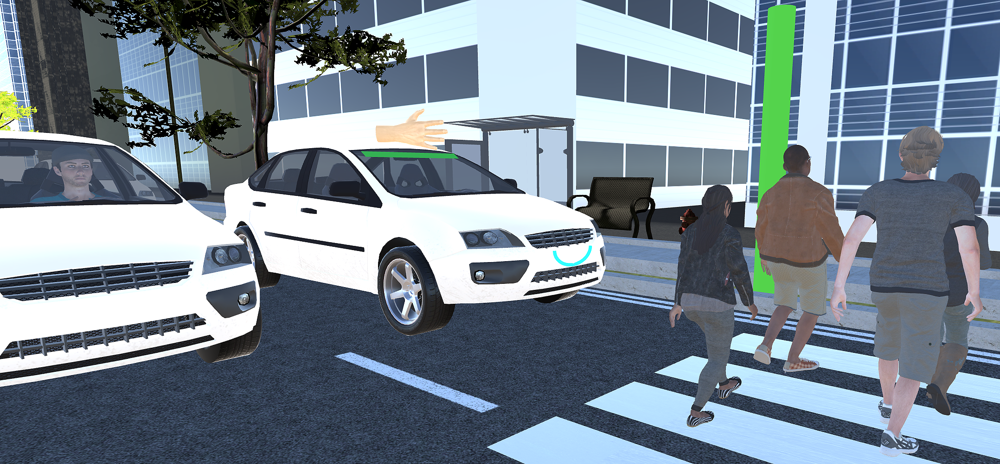
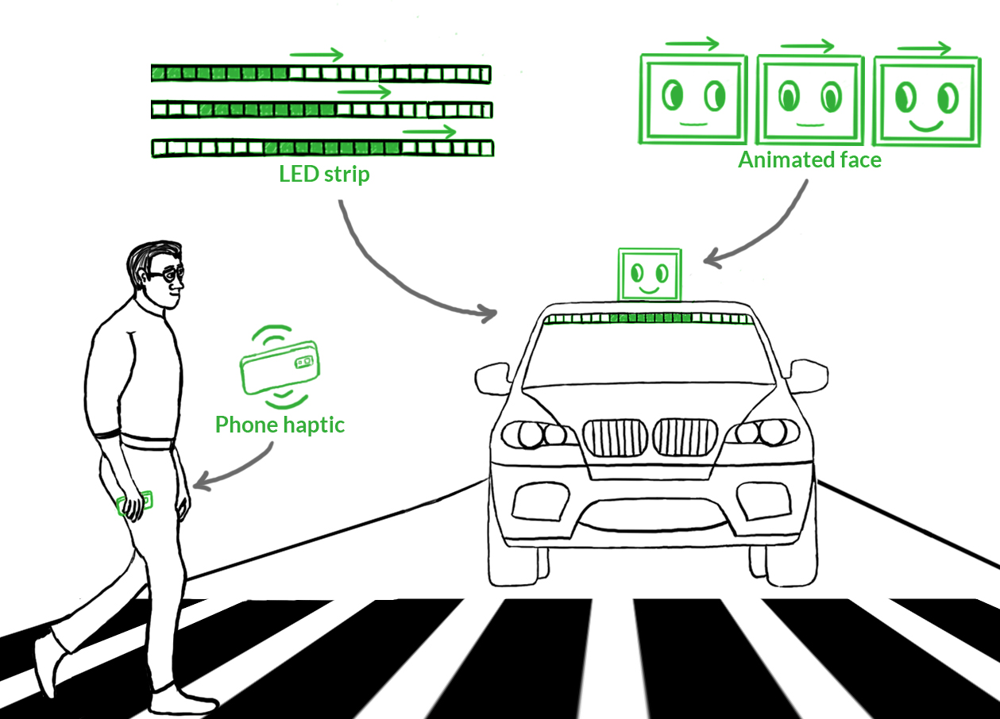
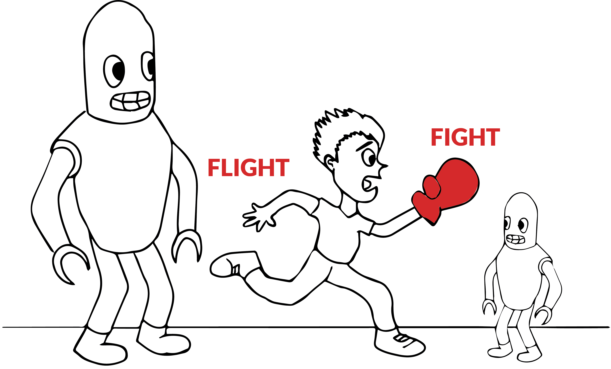

### Autonomous Vehicle-Pedestrian Interaction in Mixed Traffic

As autonomous vehicles will be gradually introduced to our streets, we will see a mixed composition of manually-driven, semi-autonomous, and autonomous vehicles during the transition period. We studied how pedestrians may interact with this intricate mix of vehicles with implications for designing future autonomous vehicle-pedestrian interfaces.

### Autonomous Vehicle-Pedestrian Interaction

This project explores the interaction problem between autonomous vehicles and pedestrians. Given fully-autonomous vehicles will not have a driver on board, pedestrians will no longer receive familiar cues from the driver such as eye gaze and gesture to aid them in making street crossing decisions. We are looking at possible ways in which we can facilitate the bi-directional communication of autonomous vehicles and pedestrians.

### Safety in Close Proximity in Human-Robot Interaction

This project explores the question of safety in the interaction of people and robots in close proximity. In particular, we are looking at whether instinctive defensive behaviors that people exhibit when faced with threat stimuli manifest in similar ways when faced with unsafe robots. We hope to eventually incorporate the understanding of human defensive behavior in the design of robot behavior.
